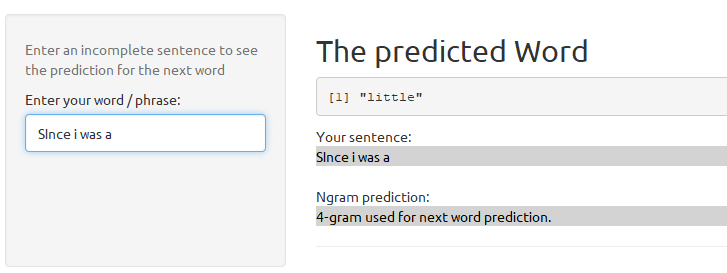

Coursera Data Science Capstone Project
========================================================
author: Carlos Silva
date: December 3, 2017
transition: linear
transition-speed: fast
autosize: true

Next Word Prediction

Introduction
========================================================
type: sub-section

Coursera Data Science Capstone Project :

- The goal of this project  is to build a Shiny application that takes as input a phrase (multiple words) in a text box input and outputs a prediction of the next word.
- The basis of the prediction algorithm is a set of three documents containing text from blogs, news and tweets.
- This Capstone Project is designed by Coursera and Johns Hopkins University in partnership with Swiftkey.
- The Shiny Application is running at: https://carlossilva34.shinyapps.io/CapstoneCoursera
- The Github Repository with all the code files is at: https://github.com/CarlosSilva34/CapstoneProjectCoursera

Cleaning the Data
========================================================
type: sub-section

The data was first processed and cleaned. :

- A subset of the original data was sampled from the three documents containing text from blogs, news and tweets and then merged into one (Corpus).
- The data sample was converted to lowercase, removing punctuation, numbers and strip white space. 
- Then the data sample was tokenized into n-grams (quadgrams, trigram and bigram).
- the term-count tables were extracted from the N-Grams and sorted according to the frequency in descending order.

Word Prediction Algorithm
========================================================
type: sub-section

The Katz Back-off algorithm :

- First the descending frequency sorted n-grams are loaded
- In the prediction model for next word, Quadgram is first used, if not found, back off to Trigram and then to Bigram.
- If no Bigram is found, back off to the most common word with highest frequency 'the' is returned.

Application
========================================================
type: sub-section

 How to use the Shiny Application :

- Enter an incomplete sentence (word/phrase) and the predicted next word is shown at the predicted word texbox.   
- In Ngram prediction texbox is shown the ngram backoff algorithm used to
prediction.

 

